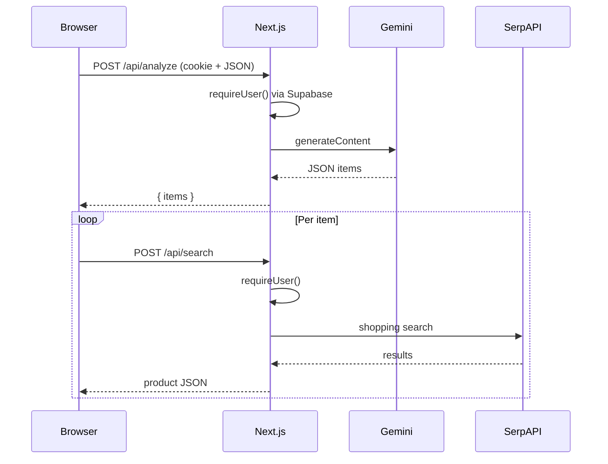

# Architecture

## Stack

| Layer | Technology |
|-------|------------|
| Framework | Next.js **16** (App Router) |
| UI | React **19**, TypeScript |
| Styling | Tailwind CSS **v4** (via PostCSS), plus inline styles in the main experience component |
| Auth | Supabase Auth (`@supabase/supabase-js`, `@supabase/ssr`) |
| Vision / LLM | Google **Gemini** (`gemini-2.5-flash`) from `POST /api/analyze` |
| Product search | **SerpAPI** Google Shopping from `POST /api/search` |

## High-level flow

1. The user signs up or signs in; Supabase stores the session in HTTP-only cookies (refreshed by middleware).
2. The home page server component loads the current user and passes it into the client `FitFind` component.
3. Logged-in users upload an image; the client sends base64 + MIME type to `/api/analyze`.
4. The analyze route verifies the session, calls Gemini, returns identified items.
5. For each item, the client calls `/api/search`; the route verifies the session, calls SerpAPI, returns a product card (or fallback).



## Source layout

```
src/
├── app/
│   ├── api/
│   │   ├── analyze/route.ts    # Gemini vision
│   │   └── search/route.ts     # SerpAPI shopping
│   ├── auth/callback/route.ts  # OAuth / email link code exchange
│   ├── login/                  # Sign-in page + form
│   ├── signup/                 # Sign-up page + form
│   ├── layout.tsx
│   ├── page.tsx                # Home; loads user, renders FitFind
│   └── globals.css
├── components/
│   └── FitFind.tsx             # Main product UI (client)
├── lib/
│   ├── auth/require-user.ts    # Shared API auth guard
│   ├── affiliate.ts            # Affiliate query params on outbound URLs
│   ├── rateLimiter.ts          # In-memory limiter (not wired to API routes)
│   └── supabase/
│       ├── client.ts           # Browser Supabase client
│       ├── server.ts           # Server Supabase client (cookies)
│       ├── service.ts          # Service-role client (Storage + DB writes, API only)
│       └── middleware.ts       # Session refresh helper
└── middleware.ts               # Runs Supabase session update on matched routes
```

## Middleware

`src/middleware.ts` invokes `updateSession` from `src/lib/supabase/middleware.ts` so auth cookies stay valid across navigations. The matcher excludes static assets and common image extensions.

Next.js may emit a deprecation notice about the `middleware` file convention in favor of a newer `proxy` convention; behavior documented here reflects the current Supabase + Next.js SSR pattern until migrated.
